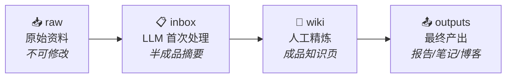

# 多物理场仿真知识库

> 基于 Karpathy LLM Wiki 方法论搭建的个人知识管理系统。

## 🧠 方法论

本知识库采用 **四阶段渐进精炼流水线**（raw → inbox → wiki → outputs）：



| 阶段 | 目录 | 职责 | 谁来做 |
|:---|:---|:---|:---|
| 1 收集 | `raw/` | 存放原始资料，**永不修改** | 人 |
| 2 消化 | `inbox/` | LLM 首次提炼：摘要、翻译、要点提取 | LLM |
| 3 精炼 | `wiki/` | 人工整理、交叉链接、持续打磨 | **你** |
| 4 产出 | `outputs/` | 基于 wiki 生成报告、笔记、博客 | LLM + 你 |

> **核心理念**：LLM 做苦力（摘要、翻译、初稿），人做判断（连接、取舍、深度理解）。原始资料永远保留不丢，知识逐层沉淀。

## 🗺️ 领域地图

本知识库覆盖以下方向：

- ⚡ [[wiki/电磁仿真/索引|电磁仿真]] — Maxwell 方程、FEM、天线、微波、EMC
- 🔥 [[wiki/热仿真/索引|热仿真]] — 热传导、对流、辐射、相变、热管理
- 💡 [[wiki/光仿真/索引|光仿真]] — 射线光学、波动光学、光子学、FDTD
- 🔌 [[wiki/EDA/索引|EDA]] — 电路仿真、PCB、信号完整性、电源完整性
- 🛠️ [[wiki/软件操作/索引|软件操作]] — COMSOL、ANSYS、CST、Lumerical、HFSS
- ❓ [[wiki/小白问答/索引|小白问答]] — 入门概念、常见误区、速查手册

## 🚀 快速上手

### 加入新资料

1. 把原始文件（PDF / 网页截图 / 笔记）丢进 `raw/` 对应子目录
2. 让 LLM 读 + 摘要 → 放入 `inbox/`，命名格式：`源文件名 - 摘要.md`
3. 有空时把 inbox 里质量好的条目精炼成 wiki 页面
4. wiki 攒够了，让 LLM 帮你生成 `outputs/` 里的学习笔记或报告

### 写作规范

- **文件名**：中文描述，清晰可读。示例：`麦克斯韦方程组.md`
- **Frontmatter**：每个 wiki 页面必含 `tags`、`created`、`updated`
- **链接**：用 `[[wiki-link]]` 连接相关知识页，不要让笔记孤立
- **模板**：从 `templates/` 复制，保持结构一致

## 📂 目录结构一览

```
多物理场仿真/
├── README.md              ← 你在这里
├── raw/                   ← 原始资料，不可修改
│   ├── 电磁仿真/
│   ├── 热仿真/
│   ├── 光仿真/
│   ├── EDA/
│   ├── 软件操作/
│   └── 论文与文献/
├── inbox/                 ← LLM 第一次处理的半成品
│   ├── 电磁仿真/
│   ├── 热仿真/
│   ├── 光仿真/
│   ├── EDA/
│   ├── 软件操作/
│   └── 小白问答/
├── wiki/                  ← 精炼后的知识（核心）
│   ├── 索引.md
│   ├── 电磁仿真/
│   ├── 热仿真/
│   ├── 光仿真/
│   ├── EDA/
│   ├── 软件操作/
│   └── 小白问答/
├── outputs/               ← 最终产出物
│   ├── 学习笔记/
│   ├── 项目报告/
│   ├── 博客文章/
│   └── 面试准备/
└── templates/             ← Markdown 模板
    ├── wiki-page-template.md
    ├── inbox-template.md
    └── raw-note-template.md
```

## 📎 参考资料

- Karpathy LLM Wiki Gist — 本知识库的方法论来源
- [[../Codex 介绍]] — 编码代理配合使用
