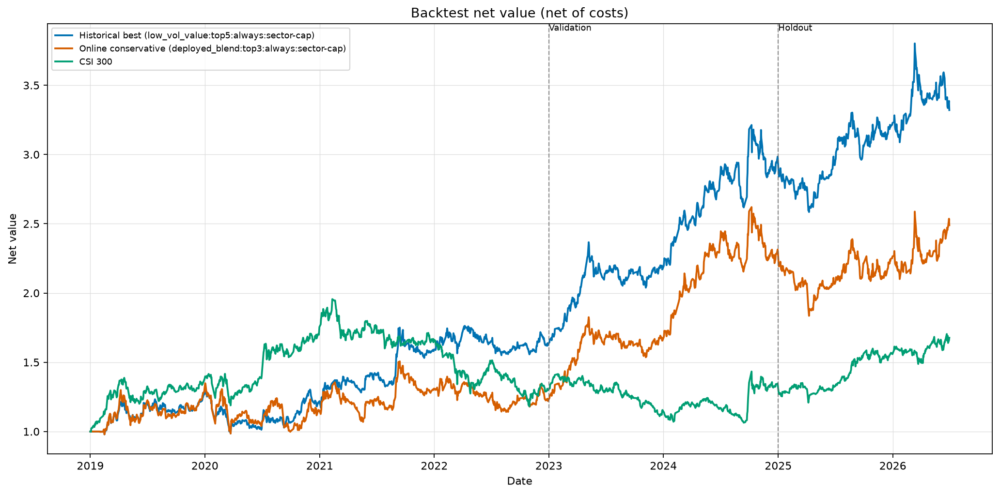
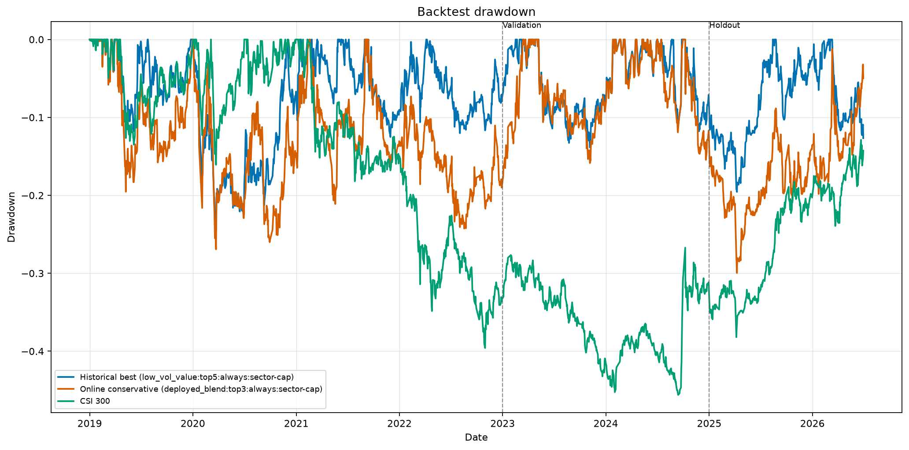

# 微信 Bot v0.9.0 选股策略统一口径回测

生成时间：2026-07-13 16:03:36

## 统计口径

- 股票池：每个月末当时的沪深300成分股，不使用今天成分股回填历史。
- 信号：月末收盘后计算；交易：下一个交易日开盘，避免同日未来数据。
- 成本：佣金双边 0.03%（每笔最低 5 元）、滑点双边 0.05%、卖出印花税按 2023-08-28 前后分别采用 0.10%/0.05%。
- 限制：停牌、ST、流动性不足和主板涨停开盘不买；初始模拟资金 10 万元。
- 分散：sector-cap 方案按当时行业分类限制集中度，前三只最多一只属于同一细分行业。
- 策略累计收益：每日扣除佣金、滑点和印花税后的净收益复利。
- 年化收益：按区间实际交易月数折算，即 `(1 + 累计收益)^(12 / 交易月数) - 1`。
- 年化超额收益：策略净年化收益减去沪深300年化收益，不是累计收益差。
- 夏普比率：日收益、年化252个交易日、无风险利率按0；Calmar为年化收益除以最大回撤绝对值。
- 年化换手率：区间买入与卖出成交额之和除以区间平均净资产，再除以区间年数；这是双边总换手。
- 策略按月整体换仓，双边年化换手理论上接近24倍，因此表中约2300%的数值不是小数点错误。
- 交易成本：区间实际扣除金额，并同时列出其占区间期初权益的比例；成本已进入策略净值，不重复扣除。
- 数据量：520 只历史成分，数据来源 BaoStock。

## Qlib 字段说明

本回测没有调用 Qlib 的回测引擎或 `PortAnaRecord`，因此不存在“Qlib 输出选择 `return` 还是 `excess_return_with_cost`”这一字段选择。程序输出的是自研回测器的 `strategy_net_return_after_cost`，佣金、滑点和印花税已经逐笔扣除；再用该净年化收益减去沪深300年化收益得到 `annual_excess_return_after_cost`。若只做语义映射，它更接近 Qlib 的 `excess_return_with_cost`，但不能标记成 Qlib 原生输出。

## 数据分段

| 区间 | 配置开始 | 配置结束 | 首个交易日 | 最后交易日 | 交易月数 | 交易日数 |
|---|---|---|---|---|---:|---:|
| 训练期 | 2019-01-01 | 2022-12-31 | 2019-01-02 | 2022-12-30 | 48 | 972 |
| 验证期 | 2023-01-01 | 2024-12-31 | 2023-01-03 | 2024-12-31 | 24 | 484 |
| 留出期 | 2025-01-01 | 2026-06-30 | 2025-01-02 | 2026-06-30 | 18 | 359 |

参数只按训练期与验证期排序；留出期不参与挑选。

## 训练与验证排名

| 排名 | 方案 | 训练年化收益 | 训练年化超额 | 验证年化收益 | 验证年化超额 | 验证最大回撤 | 稳健分 |
|---:|---|---:|---:|---:|---:|---:|---:|
| 1 | low_vol_value:top5:always:sector-cap | 13.01% | 6.15% | 34.42% | 33.60% | -13.85% | 1.303 |
| 2 | low_vol_value:top3:always:sector-cap | 10.43% | 3.58% | 28.05% | 27.24% | -16.22% | 1.157 |
| 3 | low_vol_value:top5:always:uncapped | 5.41% | -1.44% | 38.09% | 37.27% | -13.92% | 0.915 |
| 4 | low_vol_value:top5:regime:sector-cap | 8.53% | 1.67% | 14.95% | 14.14% | -15.44% | 0.839 |
| 5 | low_vol_value:top3:always:uncapped | 5.23% | -1.63% | 39.94% | 39.13% | -14.56% | 0.825 |
| 6 | low_vol_value:top10:always:sector-cap | 4.69% | -2.17% | 30.36% | 29.55% | -11.95% | 0.792 |
| 7 | deployed_blend:top5:regime:sector-cap | 5.87% | -0.99% | 16.62% | 15.81% | -15.42% | 0.775 |
| 8 | deployed_blend:top10:always:sector-cap | 5.56% | -1.30% | 22.62% | 21.80% | -15.63% | 0.753 |
| 9 | low_vol_value:top5:regime:uncapped | 3.96% | -2.90% | 21.71% | 20.89% | -14.85% | 0.737 |
| 10 | deployed_blend:top3:always:sector-cap | 5.22% | -1.64% | 36.75% | 35.93% | -15.85% | 0.736 |
| 11 | low_vol_value:top3:regime:uncapped | 4.42% | -2.44% | 24.67% | 23.86% | -16.12% | 0.719 |
| 12 | deployed_blend:top3:regime:sector-cap | 3.71% | -3.14% | 17.12% | 16.30% | -18.86% | 0.681 |

## 收益统一对比

- 历史最优策略：`low_vol_value:top5:always:sector-cap`
- 线上保守策略代理：`deployed_blend:top3:always:sector-cap`
- 以下所有策略收益均已扣除交易成本；沪深300为指数价格收益，不扣交易成本。

| 区间 | 策略 | 策略累计收益 | 策略年化收益 | 沪深300累计收益 | 沪深300年化收益 | 年化超额收益 |
|---|---|---:|---:|---:|---:|---:|
| 训练期 | 历史最优 | 63.10% | 13.01% | 30.38% | 6.86% | 6.15% |
| 训练期 | 线上保守 | 22.57% | 5.22% | 30.38% | 6.86% | -1.64% |
| 验证期 | 历史最优 | 80.68% | 34.42% | 1.63% | 0.81% | 33.60% |
| 验证期 | 线上保守 | 87.00% | 36.75% | 1.63% | 0.81% | 35.93% |
| 留出期 | 历史最优 | 12.68% | 8.28% | 26.54% | 16.99% | -8.71% |
| 留出期 | 线上保守 | 8.62% | 5.67% | 26.54% | 16.99% | -11.33% |

## 风险、换手与成本对比

| 区间 | 策略 | 最大回撤 | 夏普 | Calmar | 月度胜率 | 双边年化换手 | 累计交易成本 | 成本/期初权益 | 年化成本率 |
|---|---|---:|---:|---:|---:|---:|---:|---:|---:|
| 训练期 | 历史最优 | -24.51% | 0.71 | 0.53 | 54.17% | 2319.73% | 16,027 元 | 16.03% | 4.01% |
| 训练期 | 线上保守 | -26.92% | 0.33 | 0.19 | 52.08% | 2325.27% | 14,391 元 | 14.39% | 3.60% |
| 验证期 | 历史最优 | -13.85% | 1.68 | 2.48 | 70.83% | 2372.75% | 12,732 元 | 7.81% | 3.90% |
| 验证期 | 线上保守 | -15.85% | 1.58 | 2.32 | 66.67% | 2372.15% | 10,073 元 | 8.22% | 4.11% |
| 留出期 | 历史最优 | -12.66% | 0.57 | 0.65 | 66.67% | 2380.94% | 11,650 元 | 3.95% | 2.64% |
| 留出期 | 线上保守 | -19.93% | 0.38 | 0.28 | 55.56% | 2392.57% | 8,210 元 | 3.58% | 2.39% |

## 滚动窗口收益口径

此前提到的2019-2020、2021-2022、2023-2024百分比均指年化收益，不是累计收益。为消除歧义，下面同时列出累计与年化：

| 窗口 | 交易月数 | 历史最优累计 | 历史最优年化 | 线上保守累计 | 线上保守年化 | 沪深300累计 | 沪深300年化 |
|---|---:|---:|---:|---:|---:|---:|---:|
| 2019-2020 | 24 | 21.92% | 10.42% | 15.22% | 7.34% | 75.49% | 32.47% |
| 2021-2022 | 24 | 33.77% | 15.66% | 6.38% | 3.14% | -25.71% | -13.81% |
| 2023-2024 | 24 | 80.68% | 34.42% | 87.00% | 36.75% | 1.63% | 0.81% |
| 留出期 | 18 | 12.68% | 8.28% | 8.62% | 5.67% | 26.54% | 16.99% |

## 净值与回撤曲线

三条曲线均从2019年首个交易日开始，策略曲线为扣除成本后的净值；虚线分别标出验证期和留出期起点。整段回撤图相对2019年以来的历史高点计算，而上面的分区间指标会在各区间起点重新归一化为1，因此两者回答的问题不同。

逐日净值、收益和回撤原始表：[backtest-daily-curves.csv](backtest-daily-curves.csv)

## 逐月收益表

完整机器可读文件：[backtest-monthly-returns.csv](backtest-monthly-returns.csv)

| 月份 | 历史最优 | 线上保守 | 沪深300 |
|---|---:|---:|---:|
| 2019-01 | 0.00% | 0.00% | 7.82% |
| 2019-02 | 5.41% | 5.00% | 14.61% |
| 2019-03 | 5.93% | 8.18% | 5.53% |
| 2019-04 | 3.35% | 2.93% | 1.06% |
| 2019-05 | -3.95% | -5.39% | -7.24% |
| 2019-06 | 8.28% | 8.27% | 5.39% |
| 2019-07 | -0.12% | -2.35% | 0.26% |
| 2019-08 | -4.86% | -6.42% | -0.93% |
| 2019-09 | -0.54% | 0.93% | 0.39% |
| 2019-10 | 2.03% | 2.51% | 1.89% |
| 2019-11 | -0.35% | 1.67% | -1.49% |
| 2019-12 | 11.42% | 14.10% | 7.00% |
| 2020-01 | -9.09% | -11.32% | -2.26% |
| 2020-02 | -3.93% | 1.71% | -1.59% |
| 2020-03 | -7.28% | -9.98% | -6.44% |
| 2020-04 | 3.99% | 6.82% | 6.14% |
| 2020-05 | -5.06% | -6.73% | -1.16% |
| 2020-06 | -0.66% | -1.59% | 7.68% |
| 2020-07 | 6.13% | 16.71% | 12.75% |
| 2020-08 | 1.72% | -3.76% | 2.58% |
| 2020-09 | -3.38% | -14.73% | -4.75% |
| 2020-10 | 6.40% | 2.34% | 2.35% |
| 2020-11 | 13.47% | 18.21% | 5.64% |
| 2020-12 | -5.12% | -4.90% | 5.06% |
| 2021-01 | 7.39% | 7.81% | 2.70% |
| 2021-02 | 1.39% | 2.61% | -0.28% |
| 2021-03 | 4.38% | -3.97% | -5.40% |
| 2021-04 | -4.79% | -5.65% | 1.49% |
| 2021-05 | 6.27% | 5.21% | 4.06% |
| 2021-06 | 0.58% | 0.75% | -2.02% |
| 2021-07 | -5.57% | -4.17% | -7.90% |
| 2021-08 | 8.48% | 10.69% | -0.12% |
| 2021-09 | 12.13% | 8.07% | 1.26% |
| 2021-10 | -1.96% | -4.13% | 0.87% |
| 2021-11 | -3.57% | -6.28% | -1.56% |
| 2021-12 | 3.97% | 3.90% | 2.24% |
| 2022-01 | 2.02% | -1.05% | -7.62% |
| 2022-02 | 1.71% | 1.15% | 0.39% |
| 2022-03 | 3.64% | 2.26% | -7.84% |
| 2022-04 | 1.93% | -1.32% | -4.89% |
| 2022-05 | -4.71% | -4.45% | 1.87% |
| 2022-06 | -1.00% | -1.17% | 9.62% |
| 2022-07 | -3.92% | -5.80% | -7.02% |
| 2022-08 | 0.54% | 1.05% | -2.19% |
| 2022-09 | 1.82% | 4.20% | -6.72% |
| 2022-10 | -3.85% | -4.60% | -7.78% |
| 2022-11 | 7.33% | 8.20% | 9.81% |
| 2022-12 | -2.41% | -4.18% | 0.48% |
| 2023-01 | 6.68% | 9.37% | 7.37% |
| 2023-02 | 5.24% | 3.91% | -2.10% |
| 2023-03 | 4.90% | 8.55% | -0.46% |
| 2023-04 | 13.33% | 16.23% | -0.54% |
| 2023-05 | 0.33% | -2.31% | -5.72% |
| 2023-06 | -2.04% | -2.63% | 1.16% |
| 2023-07 | 2.84% | 1.49% | 4.48% |
| 2023-08 | -5.03% | -5.06% | -6.21% |
| 2023-09 | 2.61% | 0.74% | -2.01% |
| 2023-10 | -3.12% | -3.89% | -3.17% |
| 2023-11 | 4.85% | 6.17% | -2.14% |
| 2023-12 | -0.32% | 0.02% | -1.86% |
| 2024-01 | 9.11% | 11.85% | -6.29% |
| 2024-02 | 5.31% | 6.49% | 9.35% |
| 2024-03 | 1.31% | 5.47% | 0.61% |
| 2024-04 | 2.79% | 2.29% | 1.89% |
| 2024-05 | 5.82% | 8.50% | -0.68% |
| 2024-06 | 1.83% | 1.51% | -3.30% |
| 2024-07 | 0.23% | -3.96% | -0.57% |
| 2024-08 | -1.00% | -0.18% | -3.51% |
| 2024-09 | 14.54% | 15.23% | 20.97% |
| 2024-10 | -6.69% | -8.10% | -3.16% |
| 2024-11 | -3.39% | -5.90% | 0.66% |
| 2024-12 | 2.72% | 2.35% | 0.47% |
| 2025-01 | -3.57% | -4.87% | -2.99% |
| 2025-02 | -4.37% | -6.99% | 1.91% |
| 2025-03 | 1.15% | 1.92% | -0.07% |
| 2025-04 | -2.29% | -5.79% | -3.00% |
| 2025-05 | 5.17% | 4.58% | 1.85% |
| 2025-06 | 3.50% | 1.43% | 2.50% |
| 2025-07 | 5.49% | 4.56% | 3.54% |
| 2025-08 | 5.17% | 7.61% | 10.33% |
| 2025-09 | -5.72% | -4.77% | 3.20% |
| 2025-10 | 1.60% | -4.33% | -0.00% |
| 2025-11 | 0.80% | -0.51% | -2.46% |
| 2025-12 | 3.09% | 7.51% | 2.28% |
| 2026-01 | 0.26% | -1.88% | 1.65% |
| 2026-02 | 2.34% | -3.25% | 0.09% |
| 2026-03 | 3.68% | 5.25% | -5.53% |
| 2026-04 | -0.75% | 0.11% | 8.03% |
| 2026-05 | 2.42% | 3.56% | 1.76% |
| 2026-06 | -4.87% | 6.11% | 1.78% |

## 为什么仍上线线上保守策略

留出期事实是：历史最优年化 8.28%、最大回撤 -12.66%；线上保守年化 5.67%、最大回撤 -19.93%。线上保守在这两项上都更差，不能用“回测更安全”解释上线。

1. “保守”是相对于旧线上策略而言，不是相对于事后选出的历史最优。旧线上代理留出期最大回撤为 -27.74%，v0.9.0线上保守代理为 -19.93%。
2. 历史最优从72个组合中经训练期与验证期排序选出，仍存在模型选择偏差；它持有5只且更偏低波动/估值，天然比线上3只持仓更分散，所以留出期回撤更小并不矛盾。
3. 线上真实策略还使用10%点时基本面质量和72分准入门槛；由于本历史数据没有可靠的点时质量快照，回测中的 `deployed_blend` 只是价格与估值代理，并非线上逻辑的逐笔完全复刻。
4. 上线选择保留多因子结构、行业分散和原有持仓工作流，避免仅凭一次参数搜索就把生产策略整体换成低波动/价值组合。这个理由属于抗过拟合与运行连续性，不代表它的历史绩效更好。
5. 严格按当前回测证据，无法证明线上保守策略优于历史最优；因此v0.9.0应视为临时生产基线，历史最优应作为并行模拟挑战者做前向检验，而不是宣称线上方案已经胜出。

## 结论约束

回测用于比较规则，不保证未来盈利。即便采用历史成分与点时估值，公开数据仍可能有复权、涨跌停成交和退市数据误差。继续在同一留出期上调参会污染留出期，因此下一步应冻结参数并做前向模拟盘A/B记录。
