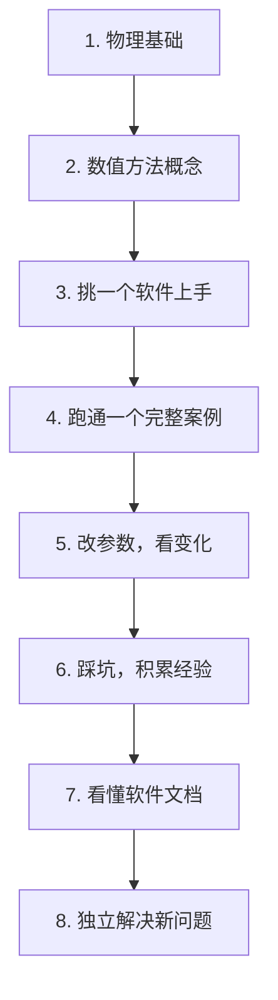

# 零基础怎么入门仿真？

> 仿真不是玄学，是物理 + 数学 + 软件 + 经验。按顺序来，每个人都能学会。

## 🗺️ 学习路线图

## 📚 各阶段学什么

### 1. 物理基础（不可跳过）

仿真不会帮你理解物理——仿真只是**数值验证**你已经理解的物理。

- 电磁仿真 → 必须懂 Maxwell 方程组
- 热仿真 → 必须懂传热三种方式
- 光仿真 → 必须懂波动光学和射线光学的边界

> **最低数学要求**：微积分 + 线性代数 + 一门数值分析入门课。

### 2. 数值方法概念（不需要自己写代码）

- 知道 FEM 是什么思路（离散化 → 插值 → 组装 → 求解）
- 知道网格是什么、收敛是什么
- 知道稳态 vs 瞬态、频域 vs 时域的区别

### 3. 挑一个软件上手

| 你的方向 | 第一个软件推荐 |
|:---|:---|
| 想做多物理场耦合 | COMSOL |
| 想做天线/RF | HFSS 或 CST |
| 想做光子学 | Lumerical |
| 想做流体/散热 | ANSYS Fluent |
| 想做电路级 | LTspice（免费） |

> 不要同时学多个软件。通一个，再学另一个。

### 4. 跑通一个完整案例

- 找一个**有解析解的简单问题**（比如矩形波导、平板电容器）
- 自己建几何 → 设材料 → 设边界 → 网格 → 求解 → 对比解析解
- **不要跳过验证这一步**——这建立了你对仿真结果的信任基线

### 5-6. 迭代 + 踩坑

- 改一个参数 → 看结果怎么变 → 想为什么
- 故意设错边界条件 → 看结果怎么坏
- 遇到报错先自己想，再看文档/论坛

## ⚠️ 新手常犯的错误

1. **跳过物理直接学软件** → 结果看不懂、参数乱设
2. **几何太复杂** → 从简单到复杂，别一上来就画整机
3. **不验证** → 不知道自己的结果靠不靠谱
4. **网格随便设** → 结果精度不够
5. **边界条件照搬别人的** → 不同问题边界条件完全不同

## 🔗 相关页面

- [[../电磁仿真/麦克斯韦方程组]]
- [[../热仿真/热传导基础]]
- [[../软件操作/索引]]
