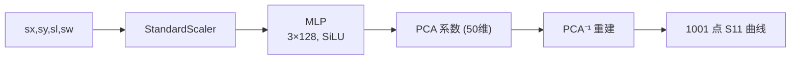
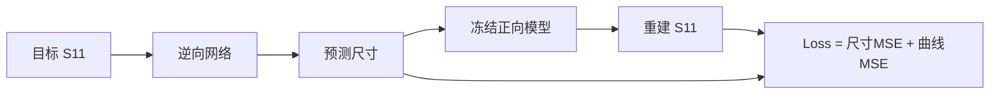

# 电磁场代理模型

> 用神经网络替代 CST/HFSS 做 S11 曲线预测——300 个样本，4 个结构参数，1001 个频点，验证 MAE 0.394 dB。

## 📖 是什么

电磁场代理模型是用机器学习方法（通常是神经网络）近似替代全波电磁仿真的技术。输入是结构几何参数，输出是 S 参数曲线或场分布。一次训练完成后，推理只需毫秒级——而原始全波仿真可能需要数十分钟到数小时。

本页记录的是一次完整的实战案例：基于 300 个 CST/HFSS 仿真样本，构建从 4 个天线结构参数到 1001 点 S11 曲线的代理模型，并延伸至逆向设计。

## 🧠 为什么重要

- **设计优化需要成千上万次仿真**——代理模型把每次"仿真"变成毫秒级推理
- **正向 + 逆向双模型**是代理模型在电磁设计中最经典的应用范式
- **多解性**是逆向设计的核心挑战——不同尺寸可能产生几乎相同的 S11 曲线，理解这一点比调参更重要

## 📊 数据集

| 属性 | 值 |
|:---|:---|
| 样本数 | 300 |
| 输入参数 | `sx` (0-12), `sy` (0-9), `sl` (1-5), `sw` (2-10) |
| 固定参数 | `L=39.6`, `W=39.6`, `Q=4` |
| 输出 | 1001 点 S11 (dB), 2.0-2.6 GHz, 步长 0.6 MHz |
| 来源 | `Backfeed_Data300.xlsx` — CST/HFSS 仿真 |

## 🔧 正向模型

### 任务

```
输入: sx, sy, sl, sw (4 个几何参数)
输出: 1001 点 S11 曲线 (2.0-2.6 GHz)
```

### 架构



- **PCA 压缩**：50 维分量解释率 99.986%，大幅降低输出维度
- **加权损失**：深谐振区域（谷底）权重 ×20，防止被大量近 0 dB 的平缓区域淹没
- **dB 域直接训练**：不转线性幅值，避免 MAPE 在深谷处失效
- **早停**：patience=500，最佳 epoch=648

### 结果

| 指标 | 训练集 | 验证集 |
|:---|---:|---:|
| 曲线 MAE | 0.217 dB | **0.394 dB** |
| 曲线 RMSE | 0.528 dB | 1.244 dB |
| 谐振频率 MAE | 1.05 MHz | **4.28 MHz** |
| 谷底深度 MAE | 1.52 dB | 4.36 dB |
| 中位 MAE | — | 0.333 dB |
| 90% 分位 MAE | — | 0.710 dB |
| 最差 MAE | — | 1.905 dB |

![[多物理场仿真/raw/模型训练/first_row_model_improvement.png]]

*51 点旧模型（师兄代码）→ 1001 点改进模型对比*

![[多物理场仿真/raw/模型训练/multiple_rows_model_comparison.png]]

*多行正向预测 vs 真实 S11。多数样本谐振位置拟合准确，少数出现异常振荡*

> **结论**：正向模型已具备较好的快速估计能力。谐振频率通常很准，谷底深度和少数困难样本仍需改进。

## 🔄 逆向模型（Tandem 架构）

### 任务

```
输入: 目标 S11 曲线 (1001 点)
输出: sx, sy, sl, sw (4 个几何参数)
验证: 预测尺寸 → 正向模型 → 重建曲线 vs 目标曲线
```

### 为什么用 Tandem

单纯的逆向网络（S11 → 尺寸）只优化尺寸误差。但逆向问题的真实目标不是"猜中原尺寸"，而是**"找到一组能产生目标曲线的尺寸"**。Tandem 架构将冻结的正向模型串接在逆向网络之后，让损失函数直接感知"这组尺寸预测出的曲线好不好"。



### 输入特征

逆向网络的输入不只是原始曲线，而是**物理特征 + PCA 压缩的混合表示**：

- 50 维 PCA 系数（和正向模型共享 PCA 空间）
- 谐振频率
- 谷底深度
- -10 dB 带宽
- 曲线积分面积

这些物理量让网络更容易"理解"曲线的关键特征。

### 结果

| 指标 | 验证集 |
|:---|:---|
| sx MAE | 2.569 |
| sy MAE | 2.208 |
| sl MAE | **0.984** |
| sw MAE | **1.040** |
| 回代曲线 MAE | **0.448 dB** |
| 回代中位 MAE | 0.256 dB |
| 谐振频率误差 | 5.18 MHz |
| 谷底深度误差 | 4.33 dB |

![[多物理场仿真/raw/模型训练/inverse_first_row_comparison.png]]

*第一条数据：预测尺寸 (5.28, 5.44, 2.78, 6.54) ≠ 真实尺寸 (10, 8.5, 1.4, 9.5)，但回代曲线 MAE 仅 0.387 dB——多解性的直接证据*

### 批量评估

![[多物理场仿真/raw/模型训练/inverse_v1_other_rows_comparison.png]]

*验证集 90 样本批量：平均回代 MAE 0.448 dB，中位 0.256 dB，90% 分位 1.337 dB*

![[多物理场仿真/raw/模型训练/inverse_v1_other_geometry_predictions.png]]

*四个代表性样本：最好（MAE 0.055 dB）、中等（0.260 dB）、偏差（0.545 dB）、最差（2.116 dB）*

## 🎯 多候选搜索

单输出逆向网络一次只给一组尺寸——但逆向映射本质上是**一对多**的。为了解决这个问题，基于正向模型实现了多起点连续优化搜索：

1. 在参数空间随机生成大量起点
2. 用正向模型对每组尺寸做曲线预测
3. 优化尺寸使预测曲线逼近目标
4. 按 MAE、频率误差、谷底误差筛选
5. 去重（剔除尺寸过于接近的候选）

| 排名 | sx | sy | sl | sw | 曲线 MAE | 频率误差 | 谷底误差 |
|:---|---:|---:|---:|---:|---:|:---|:---|
| 1 | 9.66 | 7.96 | 1.37 | 9.38 | **0.218 dB** | 0.0 MHz | 1.06 dB |
| 2 | 4.09 | 7.24 | 4.59 | 5.83 | 0.290 dB | 0.6 MHz | 1.67 dB |
| 3 | 7.35 | 4.24 | 2.75 | 7.44 | 0.307 dB | 0.0 MHz | 0.55 dB |

![[多物理场仿真/raw/模型训练/inverse_candidate_solutions.png]]

*5 组候选的曲线几乎重叠——每组的尺寸不同但都在物理上可行*

> **关键洞察**：在连续参数空间中，"所有解"理论上无限多。多候选搜索的目标不是穷举，而是输出**彼此差异明显的高质量候选集合**，供工程师根据制造约束、成本、经验做最终选择。

## ⚠️ 踩坑记录

| 坑 | 教训 |
|:---|:---|
| 数据只读了前 51 点 | 早期图片完全没显示谐振谷——核对数据范围是第一道关 |
| dB → 线性幅值 → MAPE | 深谷附近的 MAPE 完全不可靠，bB 域直接训练更有效 |
| 单输出逆向当"唯一答案" | 逆向映射不唯一，**回代曲线才是真正的评估标准** |
| 没有版本管理 | 后续约定 `v2_xxx` 命名，优化不覆盖旧版 |
| 正向代理模型仍有误差 | 候选尺寸**必须**回 CST/HFSS 验证——闭环 |

## 🔗 相关页面

- [[代理模型与降阶模型]] — 代理模型的理论基础
- [[PINN]] — 另一种物理驱动的替代方案
- [[多候选搜索策略]] — 多解性问题的通用解法（待建）
- [[Tandem 逆向设计架构]] — Tandem 的深入拆解（待建）
- [[../电磁仿真/麦克斯韦方程组]] — 代理模型要替代的物理
- [[../电磁仿真/有限元法 FEM]] — 被代理的求解器

## 🔮 改进方向

**正向模型**：
- 对最差样本区域做主动学习或局部加密采样
- 增加谐振频率、谷底深度、带宽的显式损失项
- 尝试 1D CNN / AutoEncoder / Transformer 替代 PCA
- 模型集成估计预测不确定性

**逆向模型**：
- MDN / Conditional VAE / Normalizing Flow 做概率生成
- 输出候选分布而非单一尺寸
- 候选搜索加入制造约束和设计偏好

**闭环验证**：
- 候选尺寸 → CST/HFSS 真实仿真 → 误差大的候选加入训练集 → 重新训练
- 建立"逆向生成 → 电磁仿真 → 数据回流"的迭代管线

## 📚 原始资料

- [[raw/模型训练/2026-06-09_正向与逆向模型训练记录.md|完整实验日志]]
- [[raw/模型训练/Train _forward.ipynb|正向训练 Notebook]]
- [[raw/模型训练/Train_inverse_v1_tandem.ipynb|逆向 Tandem Notebook]]
- [[raw/模型训练/search_inverse_candidates.py|多候选搜索脚本]]
