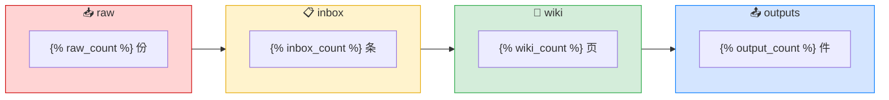

# 💎 知识工坊 · 仪表盘

> 多物理场仿真知识库的全景视图。每次打开这个页面，Dataview 会自动刷新下面的数据。

---

## 🏭 流水线概览



---

## 📋 inbox · 待审阅队列

> 下面列出所有 `status = draft` 的 inbox 条目。优先级按积压天数排列。

```dataview
TABLE 
  created AS "创建日期",
  round(date(today) - date(created)).days AS "积压(天)",
  "[[inbox/" + replace(file.folder, "多物理场仿真/inbox/", "") + "/" + file.name + "|→ 打开]]" AS "链接"
FROM "多物理场仿真/inbox"
WHERE status = "draft" AND file.name != "README"
SORT created ASC
```

---

## 📖 wiki · 最新更新

```dataview
TABLE 
  file.folder AS "领域",
  updated AS "最近更新",
  "[[wiki/" + replace(file.folder, "多物理场仿真/wiki/", "") + "/" + file.name + "|→ 打开]]" AS "链接"
FROM "多物理场仿真/wiki"
SORT updated DESC
LIMIT 10
```

---

## 🗺️ 领域健康度

```dataview
TABLE 
  length(rows) AS "页面数"
FROM "多物理场仿真/wiki"
WHERE file.name != "索引" AND file.name != "README"
GROUP BY file.folder AS "领域"
SORT length(rows) DESC
```

---

## 📥 raw · 最新入库

```dataview
TABLE 
  file.folder AS "领域",
  created AS "入库日期",
  "[[raw/" + replace(file.folder, "多物理场仿真/raw/", "") + "/" + file.name + "|→ 打开]]" AS "链接"
FROM "多物理场仿真/raw"
WHERE file.name != "README" AND file.ext = "md"
SORT created DESC
```

---

## 📤 outputs · 产出目录

```dataview
TABLE 
  file.folder AS "子类",
  file.name AS "产出文件"
FROM "多物理场仿真/outputs"
WHERE file.name != "README"
SORT file.folder ASC
```

---

## 🎯 快捷操作

| 操作 | 方式 |
|:---|:---|
| ➕ 新建 raw 资料 | `Ctrl+N` → 进入 `raw/` 子文件夹 → 自动套模板 |
| ➕ 新建 inbox 摘要 | `Ctrl+N` → 进入 `inbox/` 子文件夹 → 自动套模板 |
| ➕ 新建 wiki 页面 | `Ctrl+N` → 进入 `wiki/` 子文件夹 → 自动套模板 |
| ⬆️ inbox → wiki 升级 | 手动审阅后，内容搬过去 |
| 🤖 触发 AI 蒸馏 | Codex 每天 20:00 自动执行 |
| 📋 查看所有待办 | 打开本仪表盘 |

---

## ⚠️ 积压预警

- 🟢 0~2 天：正常
- 🟡 3~6 天：该审了
- 🔴 7 天+：再不审知识就烂在 inbox 里了！
